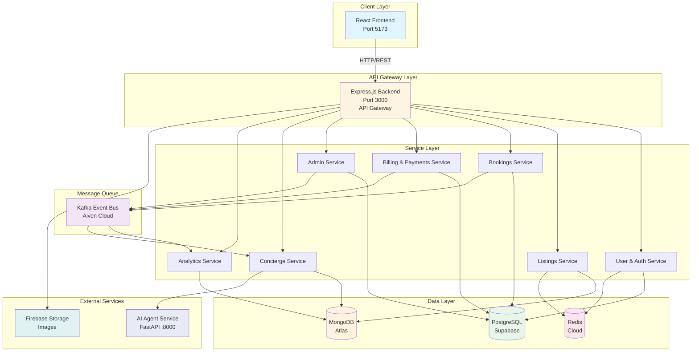
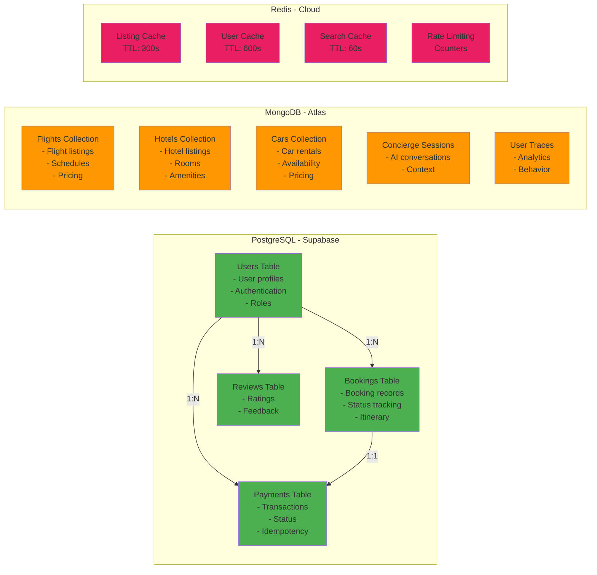
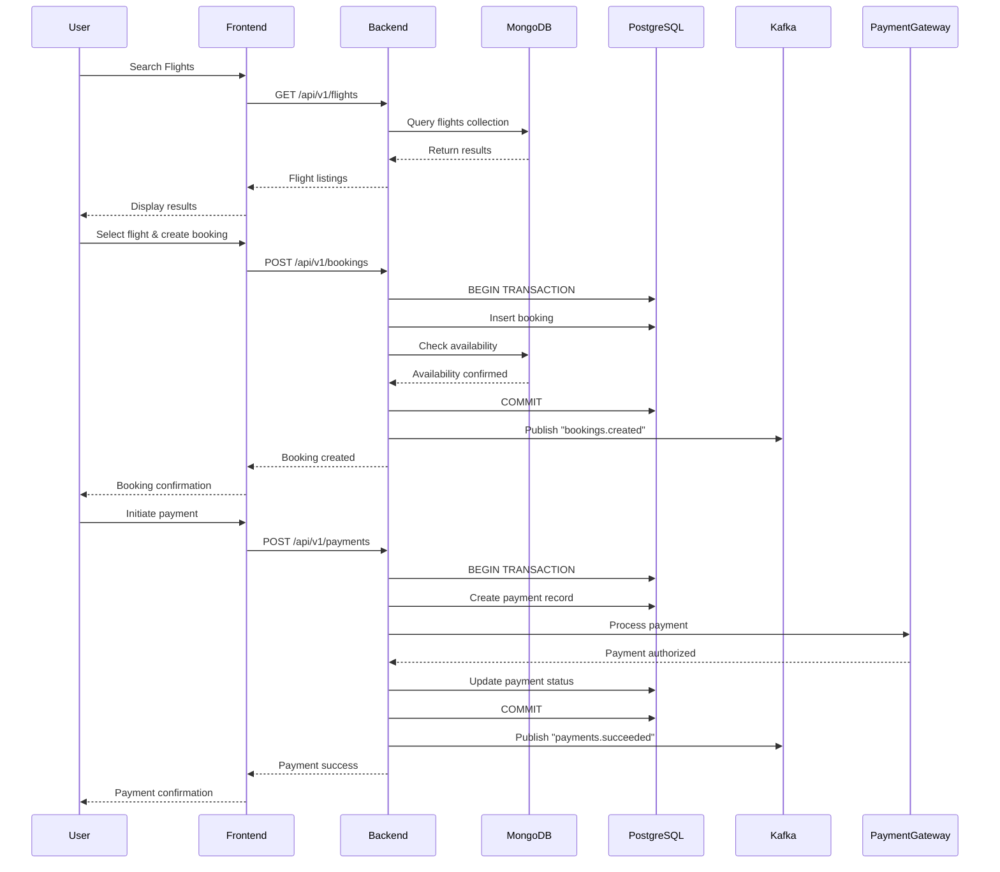
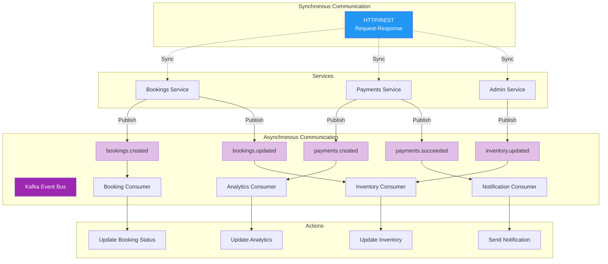

# Architecture Diagrams for PowerPoint

## Diagram 1: High-Level System Architecture

## Diagram 2: Database Architecture

## Diagram 3: Booking & Payment Flow

## Diagram 4: Service Communication & Event Flow

