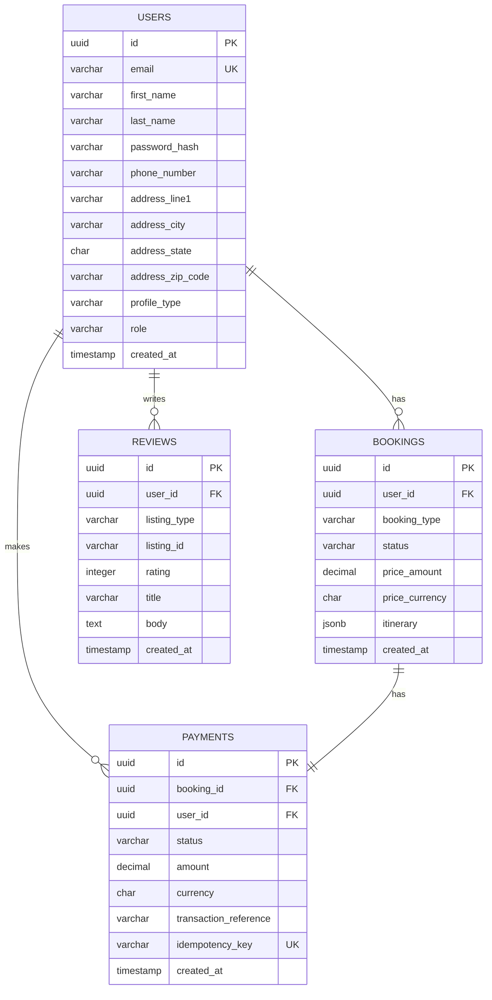
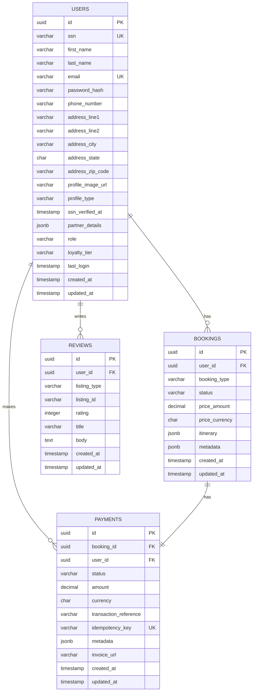
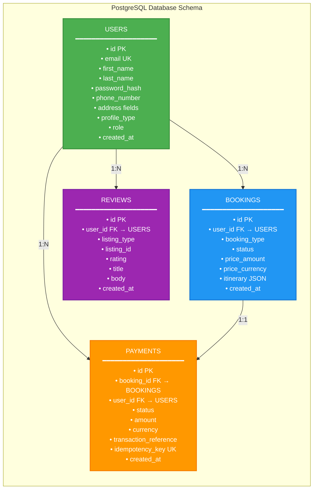
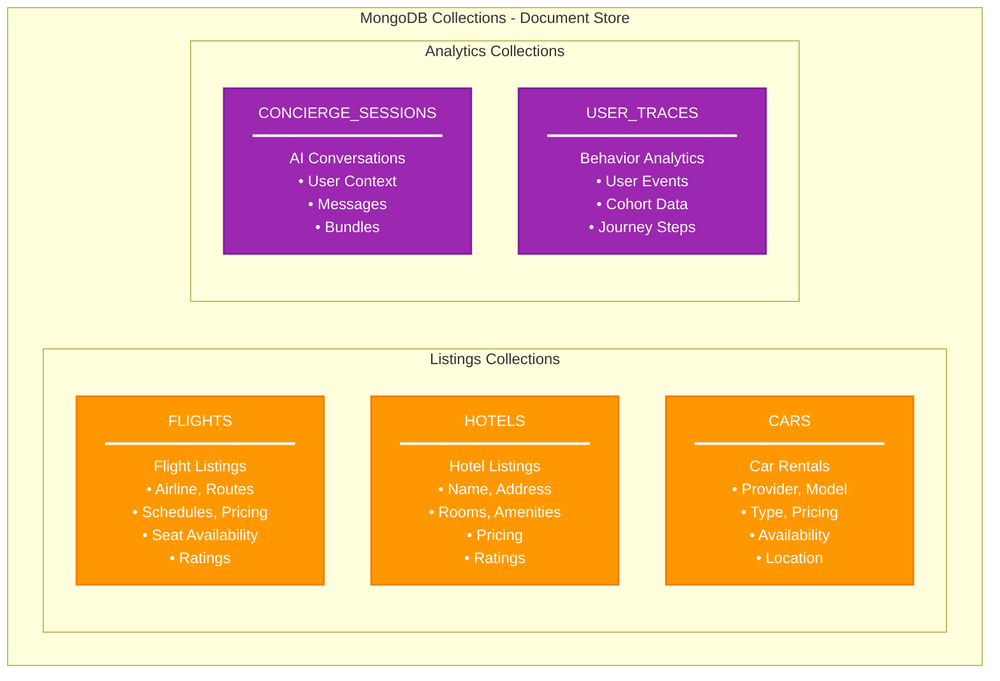
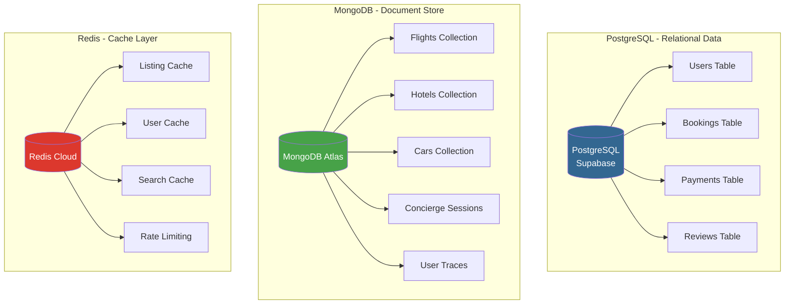

# Database Schema Diagrams

## Actual Supabase Database Schema

The actual database schema exported from Supabase is available as an SVG diagram:
- **File**: `supabase-actual-schema.svg`
- **Source**: Supabase Database Schema Export

This diagram shows the complete, up-to-date schema with all tables, relationships, and constraints as they exist in the production Supabase database.

---

## PostgreSQL Schema (Supabase) - Compact Version (For Presentation)



## PostgreSQL Schema (Supabase) - Detailed Version



## PostgreSQL Schema - Horizontal Layout (Best for PowerPoint)



## MongoDB Schema (Atlas) - Compact Version (Best for Single Slide)

```mermaid
graph LR
    subgraph "MongoDB Database Schema"
        direction TB
        
        F[FLIGHTS<br/>━━━━━━━━━━━━━━━━━━━━<br/>• _id: 'AA123'<br/>• airline<br/>• departure {airport, city, datetime}<br/>• arrival {airport, city, datetime}<br/>• durationMinutes<br/>• seats {economy, business}<br/>• basePrice {amount, currency}<br/>• fareClass<br/>• rating]
        
        H[HOTELS<br/>━━━━━━━━━━━━━━━━━━━━<br/>• _id: 'hotel_123'<br/>• name<br/>• address {street, city, state, coordinates}<br/>• rooms [{type, capacity, price, amenities}]<br/>• amenities []<br/>• rating<br/>• availableRooms]
        
        C[CARS<br/>━━━━━━━━━━━━━━━━━━━━<br/>• _id: 'car_ABC'<br/>• provider<br/>• model, year<br/>• type, transmission<br/>• seats<br/>• pricePerDay<br/>• availabilityStatus<br/>• location {pickup, return}]
        
        CS[CONCIERGE_SESSIONS<br/>━━━━━━━━━━━━━━━━━━━━<br/>• _id: ObjectId<br/>• userId<br/>• status<br/>• context {}<br/>• messages [{role, content, timestamp}]<br/>• bundles []<br/>• createdAt]
        
        UT[USER_TRACES<br/>━━━━━━━━━━━━━━━━━━━━<br/>• _id: ObjectId<br/>• userId<br/>• cohort<br/>• steps [{event, timestamp, data}]<br/>• createdAt]
    end
    
    style F fill:#FF9800,color:#fff,stroke:#F57C00,stroke-width:2px
    style H fill:#FF9800,color:#fff,stroke:#F57C00,stroke-width:2px
    style C fill:#FF9800,color:#fff,stroke:#F57C00,stroke-width:2px
    style CS fill:#9C27B0,color:#fff,stroke:#7B1FA2,stroke-width:2px
    style UT fill:#9C27B0,color:#fff,stroke:#7B1FA2,stroke-width:2px
```

## MongoDB Schema (Atlas) - Grouped Version



## MongoDB Schema (Atlas) - Detailed Version

```mermaid
graph TB
    subgraph "MongoDB Collections"
        Flights["Flights Collection<br/>━━━━━━━━━━━━━━━━━━━━<br/>{<br/>  _id: 'AA123',<br/>  airline: 'American Airlines',<br/>  departure: {<br/>    airport: 'JFK',<br/>    city: 'New York',<br/>    datetime: ISODate<br/>  },<br/>  arrival: {<br/>    airport: 'LAX',<br/>    city: 'Los Angeles',<br/>    datetime: ISODate<br/>  },<br/>  seats: {<br/>    economy: {available, price},<br/>    business: {available, price}<br/>  },<br/>  amenities: [],<br/>  rating: 4.5<br/>}"]
        
        Hotels["Hotels Collection<br/>━━━━━━━━━━━━━━━━━━━━<br/>{<br/>  _id: 'hotel_12345',<br/>  name: 'Grand Hotel',<br/>  address: {<br/>    street, city, state,<br/>    zipCode, coordinates<br/>  },<br/>  rooms: [{<br/>    type, capacity,<br/>    pricePerNight,<br/>    amenities: []<br/>  }],<br/>  amenities: [],<br/>  rating: 4.5,<br/>  reviews: []<br/>}"]
        
        Cars["Cars Collection<br/>━━━━━━━━━━━━━━━━━━━━<br/>{<br/>  _id: 'car_ABC123',<br/>  provider: 'Hertz',<br/>  model: 'Toyota Camry',<br/>  year: 2023,<br/>  type: 'sedan',<br/>  transmission: 'automatic',<br/>  seats: 5,<br/>  pricePerDay: 45,<br/>  availabilityStatus: 'available',<br/>  location: {<br/>    pickup, return<br/>  }<br/>}"]
        
        Sessions["Concierge Sessions<br/>━━━━━━━━━━━━━━━━━━━━<br/>{<br/>  _id: ObjectId,<br/>  userId: 'uuid',<br/>  status: 'active',<br/>  context: {},<br/>  messages: [{<br/>    role, content,<br/>    timestamp<br/>  }],<br/>  bundles: [],<br/>  createdAt: ISODate<br/>}"]
        
        Traces["User Traces<br/>━━━━━━━━━━━━━━━━━━━━<br/>{<br/>  _id: ObjectId,<br/>  userId: 'uuid',<br/>  cohort: 'San Jose, CA',<br/>  steps: [{<br/>    event: 'search',<br/>    timestamp,<br/>    data: {}<br/>  }],<br/>  createdAt: ISODate<br/>}"]
    end
    
    style Flights fill:#FF9800,color:#fff
    style Hotels fill:#FF9800,color:#fff
    style Cars fill:#FF9800,color:#fff
    style Sessions fill:#9C27B0,color:#fff
    style Traces fill:#9C27B0,color:#fff
```



## Redis Cache Schema

```mermaid
graph LR
    subgraph "Redis Key Patterns"
        L1["listing:flight:AA123<br/>TTL: 300s"]
        L2["listing:hotel:hotel_123<br/>TTL: 300s"]
        L3["listing:car:car_ABC<br/>TTL: 300s"]
        
        U1["user:profile:{userId}<br/>TTL: 600s"]
        
        S1["search:flights:{hash}<br/>TTL: 60s"]
        S2["search:hotels:{hash}<br/>TTL: 60s"]
        S3["search:cars:{hash}<br/>TTL: 60s"]
        
        R1["ratelimit:{userId}:{endpoint}<br/>TTL: 900s"]
        
        SE1["session:{sessionId}<br/>TTL: 86400s"]
    end
    
    style L1 fill:#DC382D,color:#fff
    style L2 fill:#DC382D,color:#fff
    style L3 fill:#DC382D,color:#fff
    style U1 fill:#DC382D,color:#fff
    style S1 fill:#DC382D,color:#fff
    style S2 fill:#DC382D,color:#fff
    style S3 fill:#DC382D,color:#fff
    style R1 fill:#DC382D,color:#fff
    style SE1 fill:#DC382D,color:#fff
```



## Complete Database Architecture


