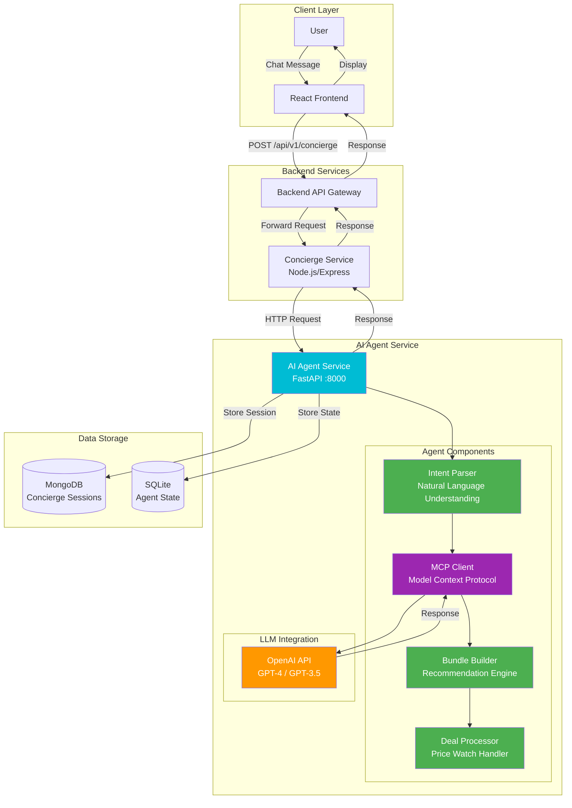
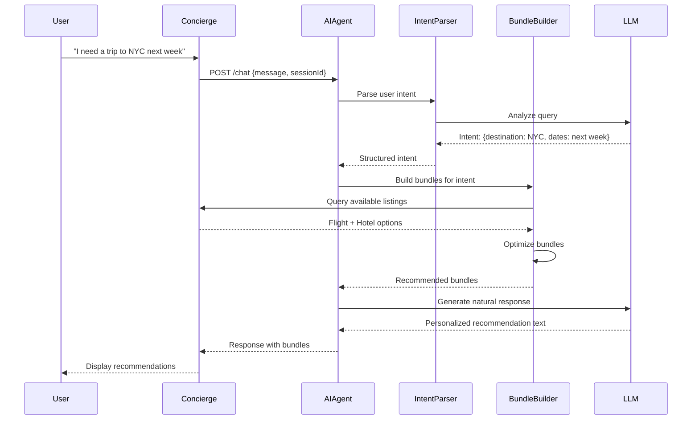

# Multi-Agents Implementation

## Overview

The Kayak clone implements a **multi-agent system** for intelligent travel recommendations and concierge services. The system uses an AI Agent service built with FastAPI that integrates with OpenAI's LLM to provide personalized travel assistance.

## Architecture



## Agent Components

### 1. Intent Parser Agent
**Purpose**: Understands user intent from natural language queries

**Capabilities**:
- Extracts travel preferences (destination, dates, budget)
- Identifies booking intent (flight, hotel, car)
- Parses complex queries with multiple requirements
- Handles ambiguous requests

**Implementation**:
- Location: `ai-agent/intent_parser.py`
- Uses OpenAI API for NLU
- Returns structured intent objects

### 2. Bundle Builder Agent
**Purpose**: Creates optimized travel bundles

**Capabilities**:
- Combines flights + hotels + cars
- Optimizes for price and convenience
- Considers user preferences
- Generates multiple bundle options

**Implementation**:
- Location: `ai-agent/bundle_builder.py`
- Queries listings service
- Applies optimization algorithms
- Returns ranked bundle recommendations

### 3. Deal Processor Agent
**Purpose**: Monitors prices and triggers deals

**Capabilities**:
- Sets up price watches
- Monitors inventory changes
- Triggers notifications on price drops
- Processes deal events from Kafka

**Implementation**:
- Location: `ai-agent/deal_processor.py`
- Listens to Kafka topics
- Updates watch status
- Sends notifications

### 4. MCP Client Agent
**Purpose**: Manages communication with LLM

**Capabilities**:
- Formats prompts for LLM
- Manages conversation context
- Handles token limits
- Processes LLM responses

**Implementation**:
- Location: `ai-agent/mcp_client.py`
- Integrates with OpenAI API
- Manages conversation history
- Handles streaming responses

## Agent Communication Flow



## Use Cases

### Use Case 1: Natural Language Search
```
User: "Find me a cheap flight to Paris in December"
Agent: Parses intent → Searches flights → Returns results
```

### Use Case 2: Bundle Recommendations
```
User: "I want a weekend trip to Miami"
Agent: Creates bundles → Optimizes price → Recommends best options
```

### Use Case 3: Price Watch
```
User: "Notify me when flights to Tokyo drop below $500"
Agent: Creates watch → Monitors prices → Sends notification
```

### Use Case 4: Conversational Booking
```
User: "What about hotels near the beach?"
Agent: Maintains context → Searches hotels → Provides recommendations
```

## Technical Implementation

### AI Agent Service Structure
```
ai-agent/
├── main.py              # FastAPI application
├── intent_parser.py     # Intent parsing agent
├── bundle_builder.py    # Bundle recommendation agent
├── deal_processor.py    # Deal processing agent
├── mcp_client.py       # LLM communication client
├── models.py           # Data models
├── mock_data.py        # Test data
└── requirements.txt    # Python dependencies
```

### API Endpoints
- `POST /chat` - Chat with concierge
- `POST /bundles` - Generate bundles
- `POST /watches` - Create price watch
- `GET /watches/{watchId}` - Get watch status
- `DELETE /watches/{watchId}` - Cancel watch

### Integration Points
1. **Backend API**: HTTP REST communication
2. **MongoDB**: Session storage
3. **Kafka**: Event consumption (price changes, inventory updates)
4. **OpenAI API**: LLM integration

## Performance Characteristics

- **Response Time**: 2-5 seconds (includes LLM call)
- **Concurrent Sessions**: Supports multiple simultaneous users
- **Context Management**: Maintains conversation history
- **Token Usage**: Optimized prompts to reduce costs

## Future Enhancements

1. **Multi-Model Support**: Support for multiple LLM providers
2. **Agent Orchestration**: Coordinate multiple agents for complex tasks
3. **Learning Agent**: Improve recommendations based on user feedback
4. **Voice Integration**: Support for voice-based interactions


